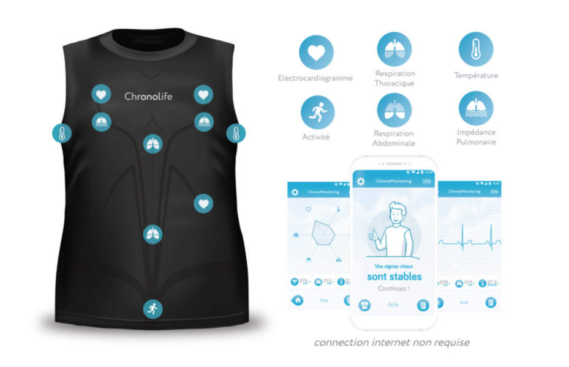

Title: About Kivy
Date: 2023-04-03
Lang: EN

When I talk to developers around me, I rarely meet one who knows the Kivy framework.

So let's talk about it.

Kivy is a cross-platform Python GUI framework. It can run on Android, iOS, Linux, macOS, and Windows. It is easy to use and fast and licensed under the MIT license.

## Advantages

The main advantages of Kivy are:

- KV language for describing the interface.
- Python and his batteries included. Imagine using one of the easy-to-use machine learning libraries available for Python.
- Python is maintainable and easy to read.
- Built for multi-touch.
- Compared to other mobile frameworks, the API is stable, and you don't waste your time running behind changes in the framework (Hello Flutter...).
- MIT license.
- Write a single codebase for deployment on many platforms.

Of course, being a cross-platform language means the UX is not native, and that's not always a problem. As a developer, I've built many mobile apps with Kivy, some with complex features that are easy to manage with Kivy, like:

- Background BLE communications with medical devices.
- Bluetooth 5 for upgrading firmware in nrf52 devices.
- A service recording GPS positions in the background for tracking runs and outdoor activities.
- Syncing files with a webdav nextcloud instance.
- Running a full machine learning engine in the background of a mobile device (thanks Python scipy and numpy).
- Accessing the Android API.

## Example

A great example is an app I made years ago that gathers data from a Bluetooth medical device and use them to predict bad events for the patient. And machine learning runs locally on the user's mobile phone, data stay private.

