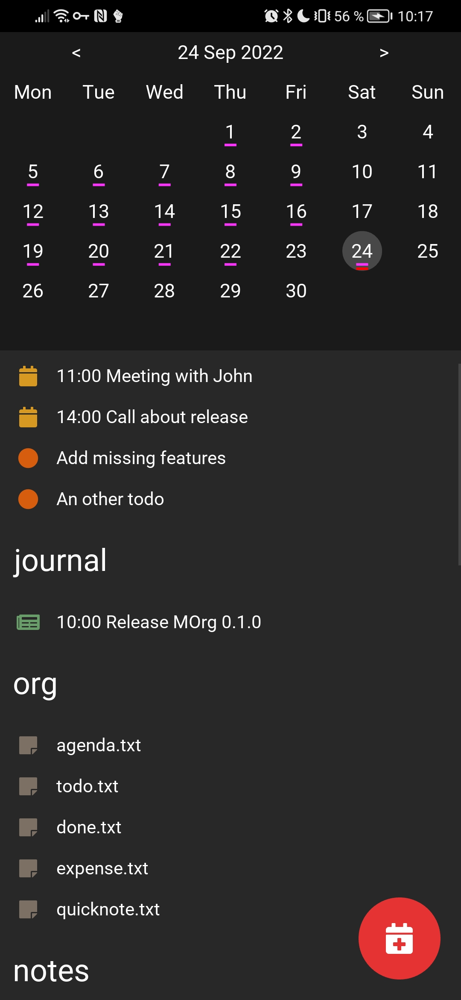

*Update 2026: this setup has since evolved, see the follow-up, [My life in plain text, revisited: Planova and one Markdown file per day](my-life-in-plain-text-using-planova-EN.html).*

For a long time I used Orgmode files to take notes, todos, and sometimes agenda events. While I like the Orgzly app on Android a lot, I wasn't happy with the sync, and worse, without a specific tool the OrgMode format is quite unusable due to its complexity.

So I tried many, many tools with Markdown support, but all of them seemed to be missing something for my use:

- On Android :
    - Markor: No agenda
    - Joplin: No agenda, and I don't like how the files are named (uuid.txt)
    - GitJournal: Only for journaling
- On Linux :
    - There is the todo.txt CLI to manage todos in a plain text file
    - vim to edit markdown

### Templates

My requirements are quite simple, so I opted for a simple file structure, and templates:

```
todo.txt (todotxt format)
done.txt (todotxt format)
agenda.txt (agendatxt format)
quicknote.txt (markdown)
expenses.txt (expensetxt format)
archives/
attachments/
journal/
  YYYY-mm-dd.txt
notes/
  a_markdown_note.md
  an_other_markdown_note.md
  Projects/
    project_1.md
    project_2.md
Posts/
  my_life_in_plain_text.md
```

#### Todotxt format

[Todo.txt: Future-proof task tracking in a file you control](http://todotxt.org/)

#### Agendatxt format

I've created an agendatxt format similar to todotxt. Each line is an event; three formats are accepted:

```
YYYY-mm-dd event for all day
YYYY-mm-dd HH:MM event at hour:minute
YYYY-mm-dd HH:MM HH:MM event with a start and a end
```

#### Expensetxt format

I've created an expensetxt format similar to todotxt. Each line is an expense:

```
YYYY-mm-dd 000.00 short description
```

#### Markdown format

[Markdown, Wikipédia](https://fr.wikipedia.org/wiki/Markdown)

## On desktop

As a dev I use vim and terminals a lot; I take notes with vim and use some zsh aliases to quickly add a todo or a journal entry.

## On mobile

This is more complex, as I need to quickly visualize events and todos, but also take notes. So I wrote my own app. It's not finished yet, and looks more like a Proof of Concept than a finished app, many features are still missing, but I use it daily.

## Screenshot



## Licence

And if you want to join me on this journey, you are more than welcome, as it's distributed under the MIT Licence.

[MOrg on GitHub](https://github.com/brvier/MOrg)
